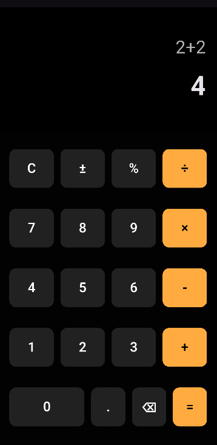

# 📱 Calculadora em Flutter

Este projeto é uma calculadora simples feita em **Flutter**, desenvolvida para treinar a construção de interfaces e manipulação de expressões matemáticas.

---

## 🎨 Estrutura da Interface (UI)

A interface foi construída usando a ideia de **árvore de widgets** do Flutter:

```
MaterialApp
 └── TelaCalculadora (StatefulWidget)
      └── Scaffold
           └── SafeArea
                └── Column
                     ├── Expanded (flex: 2)   ← Área do display (expressão + resultado)
                     │    └── Container
                     │         └── Column
                     │              ├── Align (direita)
                     │              │    └── Text (_expressao)
                     │              └── Align (direita)
                     │                   └── Text (_resultado)
                     │
                     └── Expanded (flex: 5)   ← Área do teclado (os botões)
                          └── Column
                               ├── Row (linha 1 de botões)
                               │    ├── Expanded → ElevatedButton("C")
                               │    ├── Expanded → ElevatedButton("±")
                               │    ├── Expanded → ElevatedButton("%")
                               │    └── Expanded → ElevatedButton("÷")
                               │
                               ├── Row (linha 2 de botões)
                               │    ├── Expanded → ElevatedButton("7")
                               │    ├── Expanded → ElevatedButton("8")
                               │    ├── Expanded → ElevatedButton("9")
                               │    └── Expanded → ElevatedButton("×")
                               │
                               ├── Row (linha 3 de botões)
                               │    └── ... (4 botões: 4, 5, 6, -)
                               │
                               ├── Row (linha 4 de botões)
                               │    └── ... (4 botões: 1, 2, 3, +)
                               │
                               └── Row (linha 5 de botões)
                                    ├── Expanded (flex: 2) → ElevatedButton("0")   ← ocupa o dobro
                                    ├── Expanded → ElevatedButton(".")
                                    └── Expanded → ElevatedButton("=")

```

* **Parte de cima** → mostra a conta escrita pelo utilizador e o resultado.
* **Parte de baixo** → contém o teclado (números e operadores).
* O teclado é feito com **Rows** (linhas), cada uma cheia de botões (`ElevatedButton`).
* O botão "0" ocupa o dobro do espaço (`flex: 2`).

---


Pensa nesta calculadora como uma **folha dividida em duas partes**:

* Na parte de cima, temos o **ecrã** onde aparece a conta que estamos a digitar e o resultado.
* Na parte de baixo, temos o **teclado**, organizado tal como numa calculadora física:

    * Cada linha tem os botões alinhados.
    * Os operadores (+, -, ÷, ×) aparecem destacados numa cor diferente.
    * O botão "0" é mais largo, tal como acontece em muitas calculadoras reais.

Assim, mesmo sendo digital, o design segue a lógica de uma calculadora tradicional, o que torna a utilização simples e intuitiva.

---

## 🚀 Como executar

1. Instalar o [Flutter](https://docs.flutter.dev/get-started/install).
2. Clonar este repositório.
3. Rodar no emulador ou dispositivo físico:


## 📷 Captura de tela (opcional)


---

## 🛠️ Tecnologias usadas

* Flutter
* Dart
* [math_expressions](https://pub.dev/packages/math_expressions) (para calcular as contas)

---

## ✨ Objetivo

Este projeto faz parte do meu portfólio e foi criado para **praticar a organização da interface no Flutter** e manipulação de estados.